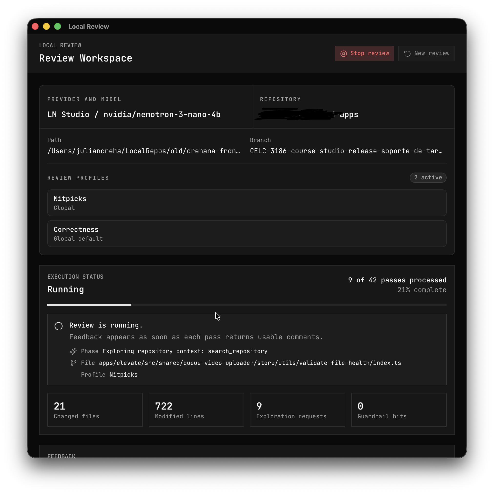

# Local Review

Local Review is a local-first desktop app for reviewing [Git](https://git-scm.com/) changes with local LLMs. It helps you turn a working tree, branch, commit, or ref comparison into structured review feedback that you can inspect, edit, accept, dismiss, and optionally publish to [GitHub](https://github.com/).

It is built for developers and maintainers who want useful review assistance without shipping repository context to a hosted model provider.



## Why Local Review?

- **Local-first review sessions**: connect to local model providers such as [LM Studio](https://lmstudio.ai/) or [Ollama](https://ollama.com/).
- **Change-set anchored feedback**: comments are validated against the selected [Git](https://git-scm.com/) changes instead of free-floating repository advice.
- **Repository exploration with guardrails**: reviewer models can search and read non-sensitive repository files when they need context.
- **Review profiles**: run focused passes such as correctness or architecture using reusable profile criteria.
- **Incremental curation**: inspect generated feedback while review passes are still running, then edit, accept, dismiss, or publish.
- **GitHub publication through [`gh`](https://cli.github.com/)**: keep review generation local while publishing approved comments through the [GitHub CLI](https://cli.github.com/).
- **Adaptive execution**: parallel review passes are bounded so local models do not overwhelm your machine.

## Tech Stack

- [Tauri 2](https://tauri.app/) for the desktop shell
- [React 19](https://react.dev/) + [TypeScript](https://www.typescriptlang.org/)
- [Vite 7](https://vite.dev/)
- [Tailwind CSS 4](https://tailwindcss.com/)
- [Rust](https://www.rust-lang.org/) backend with [Tokio](https://tokio.rs/)
- [`rig`](https://github.com/0xPlaygrounds/rig) for local model agent execution

## Requirements

- [Bun](https://bun.sh/)
- [Rust stable](https://www.rust-lang.org/tools/install)
- [Tauri system dependencies](https://tauri.app/start/prerequisites/) for your OS
- A local model provider:
  - [LM Studio](https://lmstudio.ai/) [OpenAI-compatible](https://platform.openai.com/docs/api-reference) server, default: `http://localhost:1234/v1`
  - [Ollama](https://ollama.com/), default: `http://localhost:11434`
- Optional: [GitHub CLI](https://cli.github.com/) (`gh`) for publishing accepted feedback to pull requests

## Getting Started

Install dependencies:

```bash
bun install
```

Start the [Vite](https://vite.dev/) web app:

```bash
bun run dev
```

Run the [Tauri](https://tauri.app/) desktop app in development mode:

```bash
bun run tauri dev
```

## Development Commands

```bash
# Frontend dev server
bun run dev

# Type-check and build the web assets
bun run build

# Preview the production web build
bun run preview

# Run the Tauri desktop app
bun run tauri dev

# Build the Tauri desktop app
bun run tauri build

# Rust tests
cd src-tauri
cargo test

# Rust type check
cd src-tauri
cargo check

# Rust formatting check
cd src-tauri
cargo fmt --check
```

## Local Model Setup

1. Start [LM Studio](https://lmstudio.ai/) or [Ollama](https://ollama.com/).
2. Load a model with enough context for code review.
3. Open Local Review.
4. Choose the provider and model in the setup screen.
5. Keep **Filesystem context** enabled if you want the reviewer model to inspect related repository files.

Local Review waits for the selected model to become available before starting review passes, then keeps repository exploration bounded and logged.

## Review Flow

1. Open a local [Git](https://git-scm.com/) repository.
2. Choose a change source: current branch, working tree, staged changes, unstaged changes, commit, or compare refs.
3. Select review profiles.
4. Run a review session with your local model.
5. Curate feedback in the workspace.
6. Publish approved feedback through [`gh`](https://cli.github.com/) when you want comments on a pull request.

## Repository Structure

```text
src/                  React UI, domain types, and Tauri API adapter
src-tauri/            Rust backend, Git integration, review engine, providers
docs/                 Product notes, ADRs, architecture docs, screenshots
CONTEXT.md            Project language and domain model
package.json          Frontend scripts and dependencies
src-tauri/Cargo.toml  Rust package and backend dependencies
```

## Notes

- Review feedback is generated locally and stored in local review history.
- Repository exploration is read-only and blocks sensitive paths such as environment files, keys, certificates, dumps, and likely secret-bearing files.
- Local Review does not modify your code, run tests, run linters, or execute project commands as part of a review pass.
- Generated feedback is draft material until you review and approve it.
